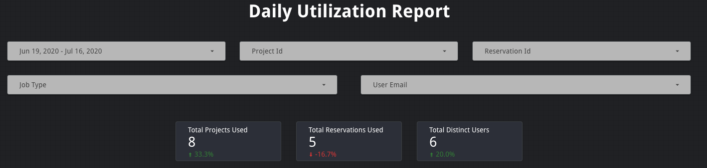
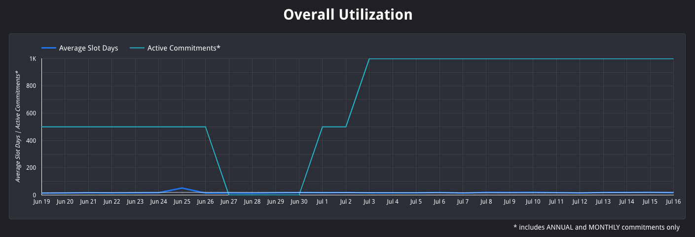
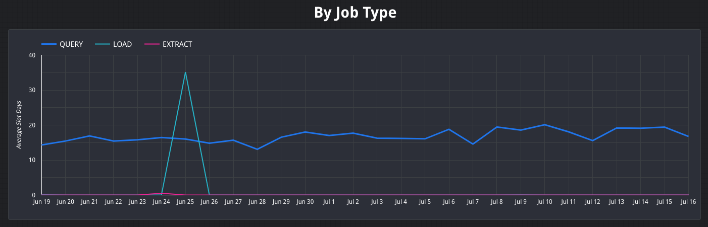
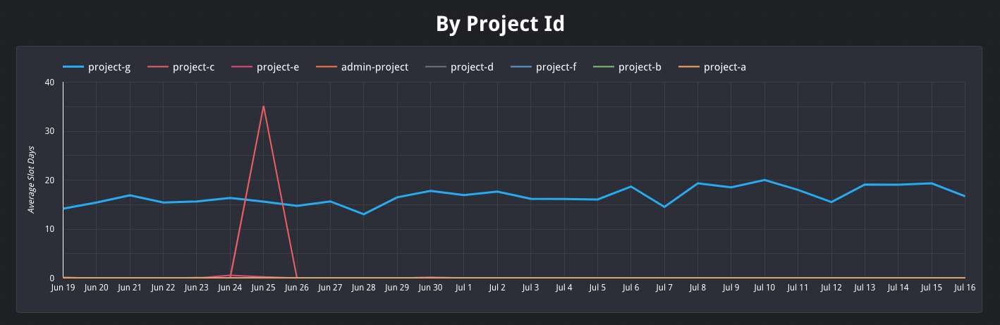
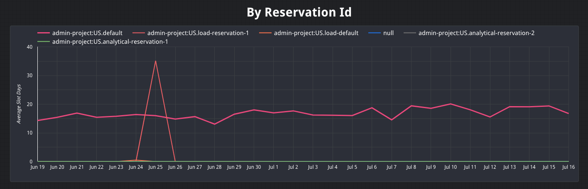
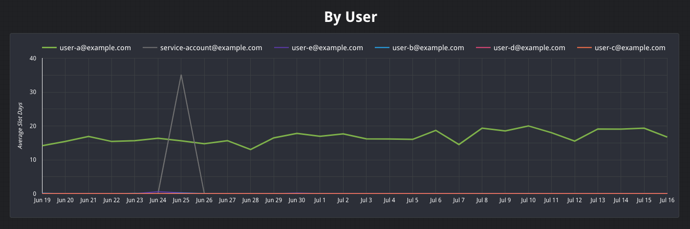
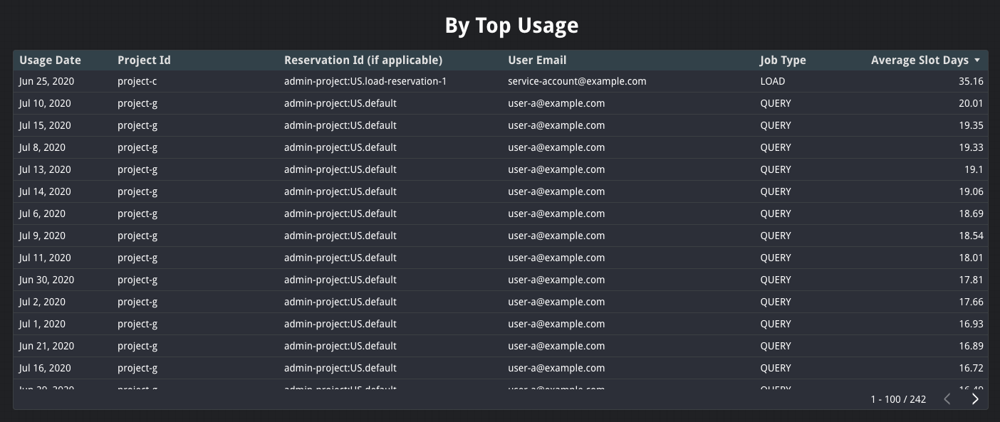

# Daily Utilization Report
The Daily Utilization Report gives an overview of an organization’s daily slot utilization measured in slot days.

Slot days are derived by dividing the total number of slot-milliseconds (`total_slot_ms`) consumed by all jobs on a given day by the number of milliseconds in a day `(1000 * 60 * 60 * 24)`. This aggregate-level computation provides the most accurate approximation of the overall slot utilization for a given day. Note that this calculation is most accurate for organizations with consistent daily slot usage. If your organization does not have consistent slot usage this number might be lower than expected.

More details about calculating average slot utilization can be found [here](https://cloud.google.com/bigquery/docs/information-schema-jobs#examples).

All timestamps in this report are in UTC.

This report leverages the [daily utilization query](../sql/daily_utilization.sql) and the [commitments query](../sql/daily_commitments.sql).

### Filter Bar & Scorecards
This report allows users to filter data by date, project id, reservation id, job type, or user email. When a filter is applied, all charts and scorecards on the page will be updated to use those filters. Dashboard owners and editors can define a default date range that is most suitable for their use case.

Below the filters are several scorecards that provide general statistics including total projects used, total reservations used, and total distinct users. These scorecards will also show how the values have changed as a percent increase or decrease relative to the previous period.

### Overall utilization
This time series graph displays overall slot utilization per day alongside the active capacity commitments for the organization. It also includes a trend line in grey. The active commitments only include those that are annual or monthly. This graph was created using a Data Studio [blended data source](https://support.google.com/datastudio/answer/9061421?hl=en) to combine the results of the [daily utilization query](../sql/daily_utilization.sql) and the [commitments query](../sql/daily_commitments.sql).

### By Job Type
This time series graph breaks down the overall slot utilization by job type (QUERY, LOAD, EXTRACT, or COPY).

### By Project Id
This time seres graph breaks down the overall slot utilization by GCP project.

### By Reservation Id
This time series graph breaks down the overall slot utilization by reservation. `null` represents usage for jobs that did not run within a specific reservation.

### By User
This time series graph breaks down the overall slot utilization by user. This can also include service accounts.

### By Top Usage
This chart displays the average usage for every day, sorted by days with the most slot usage.

