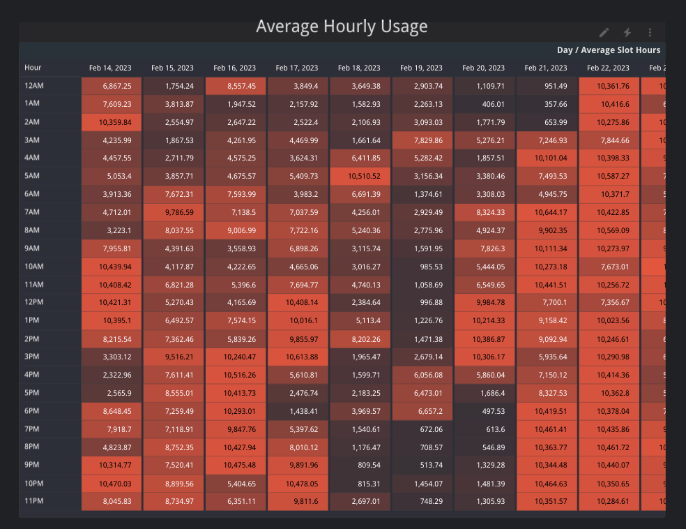

# Hourly Utilization Report
The Hourly Utilization Report gives an overview of an organization’s hourly slot utilization measured in slot hours.

Slot hours are derived by dividing the total number of slot-milliseconds (`total_slot_ms`) consumed by all jobs in a given hour by the number of milliseconds in an hour `(1000 * 60 * 60)`. This aggregate-level computation provides the most accurate approximation of the overall slot utilization for a given hour. Note that this calculation is most accurate for organizations with consistent hourly slot usage. If your organization does not have consistent slot usage this number might be lower than expected.

More details about calculating average slot utilization can be found [here](https://cloud.google.com/bigquery/docs/information-schema-jobs#examples).

All timestamps in this report are in UTC.

This report leverages the [hourly utilization query](../sql/hourly_utilization.sql).

### Filter Bar & Scorecards
This report allows users to filter data by date, project id, reservation id, job type, or user email. When a filter is applied, all charts and scorecards on the page will be updated to use those filters. Dashboard owners and editors can define a default date range that is most suitable for their use case.

Below the filters are several scorecards that provide general statistics including total projects used, total reservations used, and total distinct users. These scorecards will also show how the values have changed as a percent increase or decrease relative to the previous period.

### Overall utilization
This time series graph displays overall slot utilization per hour for an organization. It also includes a trend line in grey. Spikes in this graph would indicate that certain hours of the day had more slot usage than other hours. Periodic spikes, like the one in this example, may correspond to the execution of a scheduled query at a specific time of day.

### By Job Type
This time series graph breaks down the overall slot utilization by job type (QUERY, LOAD, EXTRACT, or COPY).

### By Project Id
This time seres graph breaks down the overall slot utilization by GCP project.

### By Reservation Id
This time series graph breaks down the overall slot utilization by reservation. `null` represents usage for jobs that did not run within a specific reservation.

### By User
This time series graph breaks down the overall slot utilization by user. This can also include service accounts.

### By Top Usage
This chart displays the average usage for every hour, sorted by days with the most slot usage.

### Hourly Heatmap
This chart displays the average slot hours used broken down by day and hour.
Cell color scales based on slot usage and the largest values are shown in red.

