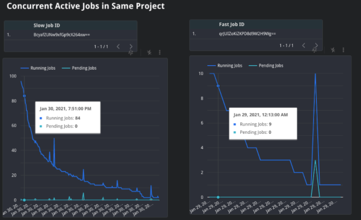
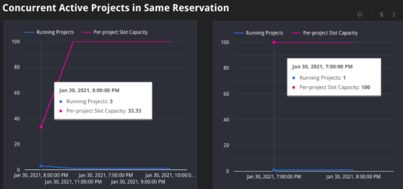

# Job Comparison Report
The [Job Comparison Report](https://datastudio.google.com/c/u/0/reporting/c30ea9f1-31d4-401a-8ab7-b3f869b75d29/page/jsQ0B/) gives an overview of how to compare job performance of two jobs, given two job IDs. 
This is meant to allow for a side-by-side troubleshooting for understanding why one query may have performed much slower than other.

The report allows you to compare the jobs' overall performance as well as the state of BigQuery for your organization while each job ran.

All timestamps in this report are in UTC.

This report leverages the [job comparison statistics query](../sql/job_comparison_statistics.sql), [slow concurrency query](../sql/job_concurrency_comparison_slow.sql), 
copy of slow concurrency query, and [slow job analyzer query](../sql/job_analyzer_slow.sql), and copy of slow job analyzer query.

### Job ID Inputs
This report allows users to enter in two job IDs: one from a fast job and one from a slow job. Please note that these should be similar jobs, such as scheduled job run at different timeframes or jobs that read in different partitions from the same underlying source table.
When a user adds an ID, all charts and scorecards on the page will be updated to use those filters. 

Below is an example of where to input your job IDs.

You will need to input both as they are configured as query parameters, `@job_param` and `@job_param_2`, in the underlying SQL.

### Side-by-side Job Comparison 
This table shows the output job statistics for two jobs. It displays key performance indicators, such as which reservation it used, duration time, total bytes processed, total slots used, total shuffle used, and more. 
This table allows the user to identify which metrics may be causing performance bottlenecks.

### Concurrency Comparison
This section allows a user to compare the reservation's respective state while each job ran. The user can also adjust the `Time Interval` dropdown to adjust how to aggregate data at either per-minute or per-hour intervals.

### Concurrent Active Jobs in Same Project
This time series graph breaks down the count of active and pending jobs which executed at the same time as both the slow and fast job. Analyzing the job count at each time period can indicate changes in demand for slots, as a high concurrency can mean less slots are available for each job, therefore impacting performance.
This uses the [Job Concurrency Slow Query](../sql/job_concurrency_comparison_slow.sql). You will need to copy 
the query and update line 44 `@job_param` to `@job_param_2` to compare results with a second job parameter.

### Concurrent Active Projects in Same Reservation
This time series graph breaks down the count of active projects and amount of slots available for each job. For Y projects, each project will receive 1/Y of the reservation's total slots. 
Analyzing the project count at each time frame can indicate changes in demand for slots, as a high concurrency can mean that less slots are available for each project, therefore impacting performance.

### Job Stages as Percentage of Time
This bar chart allows you to compare the stages of execution between queries. 
This uses both the [Slow Job Analyzer Query](../sql/job_analyzer_slow.sql) and copy of it with a second parameter for comparing results.

This can help to find bottlenecks in performance and where the query spends the most processing time.
This is useful as it can indicate changes in data shape. Specifically, the `input` stages depict how much data is read in from source tables. Deviations between jobs can therefore indicate the the source data has grown or decreased. 
Additionally, other stages can indicate areas for optimization in the query, such as the `join` stage, which can show if the data is unbalanced.

### Slot Utilization and Capacity Overview
This time series graph displays the total slot capacity allocated and used during the query's runtime.
This graph indicates the relative level of saturation and demand for slots at the same time as the query. 
The graph also displays the organization-wide capacity. This is useful to see as if a reservation used more than its granted capacity, it likely used
idle slots from other reservations in the organization.

