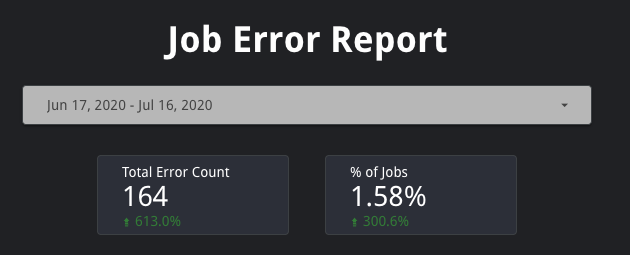
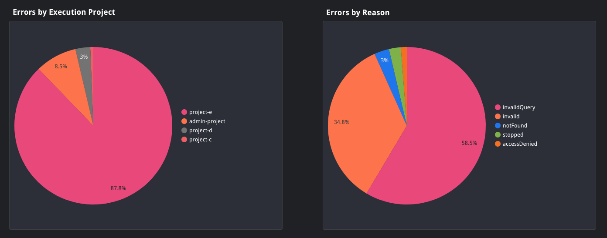
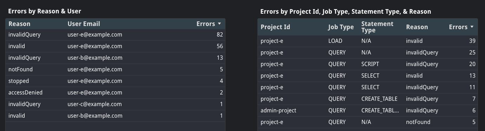

# Job Error Report
The Job Error Report provides an overview of the types of errors encountered by jobs in the organization.

This report leverages the [job error query](../sql/job_error.sql).

### Filter Bar & Scorecards
This report allows users to filter data by date. Dashboard owners and editors can define a default date range that is most suitable for their use case.

Below the filters are two scorecards that provide general statistics including total error count and percent of jobs that returned an error. These scorecards will also show how the values have changed as a percent increase or decrease relative to the previous period.

### Error Charts
These pie charts provide a breakdown of the errors across the organization by execution project only and error reason only.

### Error Tables
These tables provide more granular information about error trends, including errors by reason and user together and errors by project id, job type, statement type, and reason together. These tables are sorted by highest error count.

