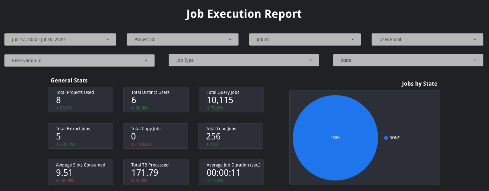

# Job Execution Report
The Job Execution Report provides a per-job breakdown of slot utilization among other job statistics. The purpose of this report is to allow users to drill down into individual jobs or understand trends in a specific group of jobs.

In this report, the slot utilization is displayed on a per-job level instead of an aggregate level. As such, it is calculated by dividing the total number of slot-milliseconds (`total_slot_ms`) consumed by the job by its duration in milliseconds (`(TIMESTAMP_DIFF(end_time, start_time, MILLISECOND))`).

All timestamps in this report are in UTC.

This report leverages the [job execution query](../sql/job_execution.sql).

### Filter Bar & Scorecards
This report allows users to filter data by date, project id, job id, user email, reservation id, job type, or state. When a filter is applied, all charts and scorecards on the page will be updated to use those filters. Dashboard owners and editors can define a default date range that is most suitable for their use case.

Below the filters are several scorecards that provide general statistics including total projects used, total distinct users, total query/load/copy/extract jobs, average slots consumed, total TBs processed, and average job duration. These scorecards will also show how the values have changed as a percent increase or decrease relative to the previous period. There is also a pie chart showing jobs by state (`PENDING`, `RUNNING`, or `DONE`).

### Job Execution Table
This table provides statistics about individual jobs including: execution project id, job id, reservation id (if applicable, `null` otherwise), job start time and end time (in UTC), job duration (in seconds), job type, job state, user email, average slots consumed, and total bytes processed.

By default this table is sorted by job end time (descending) but can by sorted by any of the other fields.

