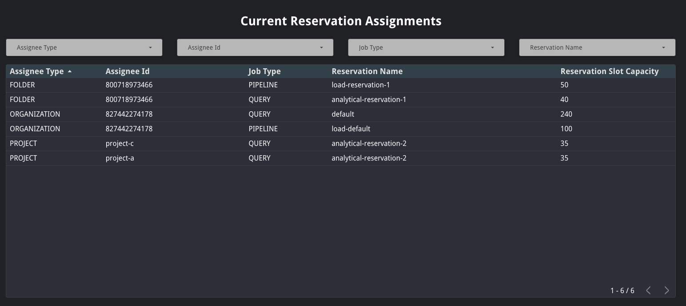
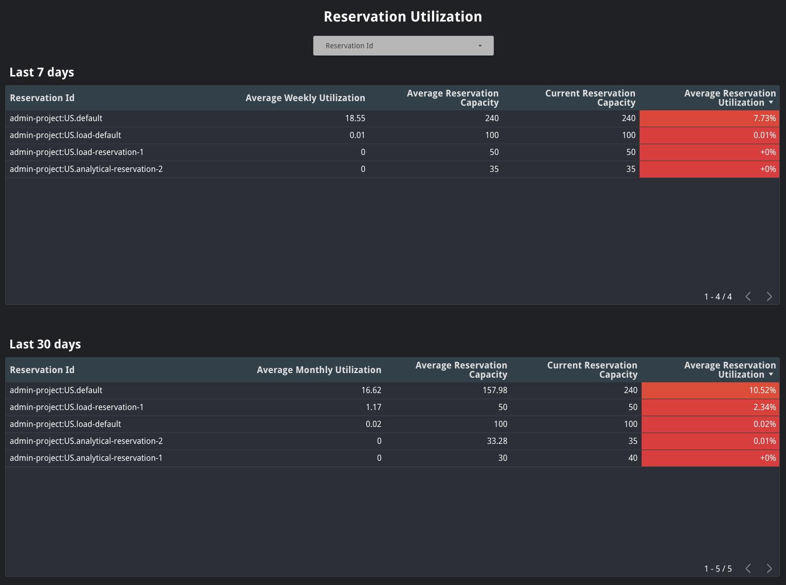

# Reservation Utilization Report
The Reservation Utilization Report gives an overview of an organization’s current assignments and reservation utilization in the last 7 and 30 days.

This report leverages the [current assignments query](../sql/current_assignments.sql), the [weekly reservation utilization query](../sql/reservation_utilization_week.sql), and the [monthly reservation utilization query](../sql/reservation_utilization_week.sql).

### Current Reservation Assignments
This table displays details for the current assignments across an organization. This table is very similar to the one in the BigQuery UI, however it includes the job type for an assignment and the reservation slot capacity.

Users can filter by assignee type (`ORGANIZATION`, `FOLDER`, or `PROJECT`), assignee id, job type, or reservation name to narrow down the data.

### Reservation utilization
These tables display information about the utilization of a given reservation in the last 7 or 30 days. This includes average weekly or monthly slot utilization, average reservation capacity, current reservation capacity, and average reservation utilization.

Average weekly and monthly utilization are derived by dividing the total number of slot-milliseconds (`total_slot_ms`) consumed by all jobs in the last 7 or 30 days by the number of milliseconds in a week or month&mdash; `(1000 * 60 * 60 * 24 * 7)` and `(1000 * 60 * 60 * 24 * 30)` respectively. This aggregate-level computation provides the most accurate approximation of the overall slot utilization for a given week or month. Note that this calculation is most accurate for organizations with consistent slot usage. If your organization does not have consistent slot usage this number might be lower than expected.

Average reservation capacity is computed by taking the average of the reservation capacity across the last 7 or 30 days. This will take into account any changes made to the reservation capacity in a way that makes the reservation utilization more accurate.

Average reservation capacity is computed by averaging the reservation capacity across all jobs that ran under a given reservation in the last 7 of 30 days. This is done to take into account any changes made to the reservation capacity during the time period. For example, if a reservation was increased from 10 slots to 30 slots on a given day, then the average reservation capacity for that day would be the average of the reservation capacity of all jobs run that day; this value slightly different than a simple average of the two capacities (20, in this case) as it accounts for the fact that a different number of jobs may have been executed before and after the change.

Average reservation utilization is computed by dividing the average weekly or monthly utilization by the average reservation capacity. Reservations that are severely over or under utilized are colored in red, while reservations that are close to 100% utilization are colored in green. That said, because [idle slot capacity is shared across reservations](https://cloud.google.com/bigquery/docs/reservations-intro#idle_slots) by default, underutilized reservations do not necessarily indicate that slots are being wasted. Instead, the jobs in that reservation simply do not need as many slots reserved.

Users can filter by one or more reservation ids to narrow down the data.

