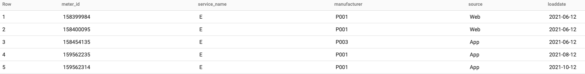
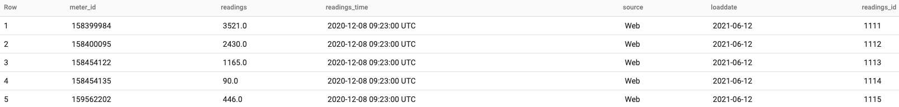
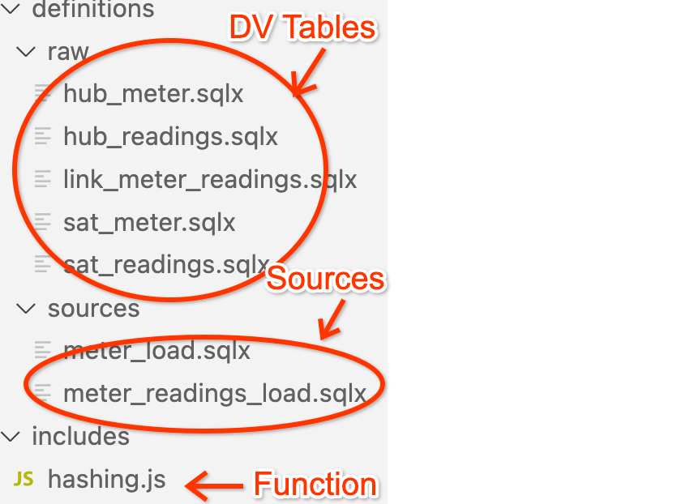

## Data Vault in BigQuery using Dataform
In this repository, we provide an example Dataform project that transforms data in BigQuery following Data Vault 2.0 modeling technique.
Data Vault is a recent modeling technique for data warehouses in addition to the traditional 3NF and Dimensional with the main goals of agility and auditability. 
Fundamentally, Data Vault moves relationships between the entities to separate tables so that entities can grow independently of each other. 
New relationships can be created or removed without any change in the existing tables.

Dataform is an application to manage data pipelines for data warehouses like BigQuery, Snowflake, and Redshift. 
It enables data teams to build scalable, tested, SQL based data transformation pipelines using version control and engineering led best practices. It compiles hundreds of data models in under a second using SQLX. SQLX extends your existing SQL warehouse dialect to add features that support dependency management, testing, documentation and more.

### Example DataVault implementation on BigQuery by using Dataform

Use Case: As an energy company would like to store, analyze and provide insights on data from meters and meter readings. 
We have stored source data in staging dataset about meter and meter readings. And, in "raw" dataset datavault tables(hubs, links & satellites) are created in BigQuery using dataform lib. 

The sqlx files for hubs, satellites & links are placed under [definitions](https://github.com/prabhaarya/bigquery-utils/tree/feature/dataform-datavault/dataform/examples/dataform_datavault/definitions/raw) folder and any functions used needs to placed under [includes](https://github.com/prabhaarya/bigquery-utils/tree/feature/dataform-datavault/dataform/examples/dataform_datavault/includes) folder. 

### Source table schemas:
Meter Staging table:

  ```shell
  CREATE OR REPLACE TABLE staging.meter_load
  (
  meter_id INTEGER,
  manufacturer STRING,
  service_name STRING,
  source STRING,
  loaddate DATE
  );
  ```

Meter Readings Staging table:

  ```shell
  CREATE OR REPLACE TABLE staging.meter_readings_load
  (
  readings_id INTEGER,
  meter_id INTEGER,
  readings FLOAT64,
  readings_time TIMESTAMP,
  source STRING,
  loaddate DATE
  );
  ```

### Source table exports:
1. meter_load --> Meter table contains data about meter.
   

2. meter_readings_load --> Meter readings table contains data about meter readings.
   

## How to use?

### Pre-requsites:
1. npm lib needs be installed
2. [Google cloud project](https://developers.google.com/workspace/guides/create-project) should be available
3. BigQuery api is enabled
4. [Dataform lib ](https://docs.dataform.co/dataform-cli) using NPM


### Steps to follow:
All the steps below can be used via terminal or Use the CloudShell editor.

In order to test and run the dataform, please run the following steps:

1. Generate the Dataform credentials file by running the following:
```
dataform init-creds bigquery
```
> Note: You will be prompted to select the following:
>  * Your dataset location **(select ‘US’)**
>  * Your authentication method **(select Application Default Credentials)**.
>  * Your billing project ID (select the project in which you’ll run your queries).

2. User has to replace project id, please add them into this [file](./dataform.json). 

3. Compile & Run
    ```shell
    dataform compile
    dataform run
    ```
  - The overview of project structure will look like the following image: 

    

  - The below video, shows all the steps visually:

    <image src="screenshots/dataform_demo_gif.gif" width=450>


## LICENSE
All solutions within this repository are provided under
Copyright 2022 Google LLC

Licensed under the Apache License, Version 2.0 (the "License");
you may not use this file except in compliance with the License.
You may obtain a copy of the License at

https://www.apache.org/licenses/LICENSE-2.0

Unless required by applicable law or agreed to in writing, software
distributed under the License is distributed on an "AS IS" BASIS,
WITHOUT WARRANTIES OR CONDITIONS OF ANY KIND, either express or implied.
See the License for the specific language governing permissions and
limitations under the License.
