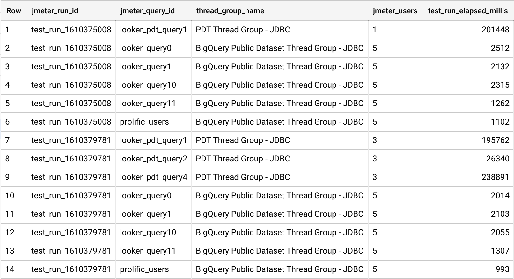

# JMeter example

This directory contains an example JMeter JMX file and sample queries
that use BigQuery public datasets. The instructions that follow will guide
you to execute a test run using the JMeter JDBC sampler using queries from
a CSV file.

# Requirements

* Apache JMeter (5.3 or later)
* A GCP project with BigQuery enabled

# Getting JMeter

Note that the scripts provided expect that you'll download
JMeter to this directory as described in the following
instructions.

You can download and unpack JMeter to this directory:

```
curl -L https://downloads.apache.org/jmeter/binaries/apache-jmeter-5.4.tgz | tar -xzf -
```

You will also need the Simba JDBC driver for BigQuery unpacked to JMeter's `lib` directory:

```
curl -LO https://storage.googleapis.com/simba-bq-release/jdbc/SimbaJDBCDriverforGoogleBigQuery42_1.2.12.1015.zip
unzip -n SimbaJDBCDriverforGoogleBigQuery42_1.2.12.1015.zip -d apache-jmeter-5.4/lib
```

Inspect the queries in the CSV files. Note that there's a query per line in the file, and
that they need to remain as a single line.

Next, you can execute the example test plan, which is configured in the included
JMX file, `BigQuery-BI-and-ELT.jmx`.

```
export PROJECT_ID=$(gcloud config get-value project)
bash run_jmeter_jdbc_sampler.sh
```

Your output should look something like this (you can safely ignore the warnings):

```
$ bash run_jmeter_jdbc_sampler.sh
Creating summariser <summary>
Created the tree successfully using BigQuery-BI-and-ELT.jmx
Starting standalone test @ Mon Jan 11 09:23:29 EST 2021 (1610375009478)
Waiting for possible Shutdown/StopTestNow/HeapDump/ThreadDump message on port 4445
Jan 11, 2021 9:23:31 AM com.google.auth.oauth2.DefaultCredentialsProvider warnAboutProblematicCredentials
WARNING: Your application has authenticated using end user credentials from Google Cloud SDK. We recommend that most server applications use service accounts instead. If your application continues to use end user credentials from Cloud SDK, you might receive a "quota exceeded" or "API not enabled" error. For more information about service accounts, see https://cloud.google.com/docs/authentication/.
summary +      2 in 00:03:32 =    0.0/s Avg: 105721 Min:  3038 Max: 208404 Err:     0 (0.00%) Active: 5 Started: 6 Finished: 1
summary +      4 in 00:00:02 =    2.0/s Avg:  4426 Min:  3139 Max:  5043 Err:     0 (0.00%) Active: 0 Started: 6 Finished: 6
summary =      6 in 00:03:34 =    0.0/s Avg: 38191 Min:  3038 Max: 208404 Err:     0 (0.00%)
Tidying up ...    @ Mon Jan 11 09:27:03 EST 2021 (1610375223250)
... end of run
```

Open the [BigQuery console](https://console.cloud.google.com/bigquery). Ensure that
you are in the project that you set as the gcloud default.

You should see in the query history that six queries have been run. With the
following query, you can count the number of queries executed in each JMeter
thread group:

```sql
WITH
  test_run_queries AS (
  SELECT
    *,
    JSON_EXTRACT_ARRAY(REGEXP_EXTRACT(query, r"^/\*(.*)\*/"),
      '$') AS jmeter_metadata_rows
  FROM
    `region-us`.INFORMATION_SCHEMA.JOBS_BY_PROJECT
  WHERE
    REGEXP_CONTAINS(query, r'^/\*.*\*/')
    AND query LIKE '%"test_plan": "BigQuery-BI-and-ELT.jmx"%'),
  test_run_queries_with_metadata_columns AS (
  SELECT
    -- Extract specific fields from the metadata JSON passed above.
    JSON_EXTRACT_SCALAR(jmeter_metadata,
      '$.run_id') AS jmeter_run_id,
    JSON_EXTRACT_SCALAR(jmeter_metadata,
      '$.query_id') AS jmeter_query_id,
    JSON_EXTRACT_SCALAR(jmeter_metadata,
      '$.num_users') AS jmeter_users,
    SAFE_CAST(JSON_EXTRACT_SCALAR(jmeter_metadata,
        '$.num_slots') AS INT64) AS num_slots,
    JSON_EXTRACT_SCALAR(jmeter_metadata,
      '$.test_plan') AS test_plan,
    JSON_EXTRACT_SCALAR(jmeter_metadata,
      '$.thread_group_name') AS thread_group_name,
    JSON_EXTRACT_SCALAR(jmeter_metadata,
      '$.thread_num') AS thread_number,
    * EXCEPT(jmeter_metadata)
  FROM
    test_run_queries,
    UNNEST(jmeter_metadata_rows) AS jmeter_metadata
  WHERE
    jmeter_metadata_rows IS NOT NULL)

SELECT
  jmeter_run_id,
  test_plan,
  thread_group_name,
  COUNT(*) as queries_run
FROM
  test_run_queries_with_metadata_columns
GROUP BY
  jmeter_run_id,
  test_plan,
  thread_group_name
```

Your results should look something like the following:


Next you can extend the query to show how long each thread group took to run.

N.B. - the base CTE is the same as above, but the query that uses the CTE is
different:

```sql
WITH
  test_run_queries AS (
  SELECT
    *,
    JSON_EXTRACT_ARRAY(REGEXP_EXTRACT(query, r"^/\*(.*)\*/"),
      '$') AS jmeter_metadata_rows
  FROM
    `region-us`.INFORMATION_SCHEMA.JOBS_BY_PROJECT
  WHERE
    REGEXP_CONTAINS(query, r'^/\*.*\*/')
    AND query LIKE '%"test_plan": "BigQuery-BI-and-ELT.jmx"%'),
  test_run_queries_with_metadata_columns AS (
  SELECT
    -- Extract specific fields from the metadata JSON passed above.
    JSON_EXTRACT_SCALAR(jmeter_metadata,
      '$.run_id') AS jmeter_run_id,
    JSON_EXTRACT_SCALAR(jmeter_metadata,
      '$.query_id') AS jmeter_query_id,
    JSON_EXTRACT_SCALAR(jmeter_metadata,
      '$.num_users') AS jmeter_users,
    SAFE_CAST(JSON_EXTRACT_SCALAR(jmeter_metadata,
        '$.num_slots') AS INT64) AS num_slots,
    JSON_EXTRACT_SCALAR(jmeter_metadata,
      '$.test_plan') AS test_plan,
    JSON_EXTRACT_SCALAR(jmeter_metadata,
      '$.thread_group_name') AS thread_group_name,
    JSON_EXTRACT_SCALAR(jmeter_metadata,
      '$.thread_num') AS thread_number,
    * EXCEPT(jmeter_metadata)
  FROM
    test_run_queries,
    UNNEST(jmeter_metadata_rows) AS jmeter_metadata
  WHERE
    jmeter_metadata_rows IS NOT NULL)

SELECT
  TIMESTAMP_DIFF(MAX(end_time), MIN(creation_time), MILLISECOND) AS test_run_elapsed_millis
FROM
  test_run_queries_with_metadata_columns
GROUP BY
  jmeter_run_id
```

How long does the test run take in your project?

Now let's make a small modification to the script. There is only one user for
the PDT (Persistent Derived Tables) query, but there are more than one query in
the CSV file. Let's make sure all the queries get run by increasing the number
of users to equal the number of queries.

Edit `run_jmeter_jdbc_sampler.sh` and change the line that contains `-Jpdt_num_users`
to look like this:

```
-Jpdt_num_users=3
```

And re-run the test:

```
export PROJECT_ID=$(gcloud config get-value project)
bash run_jmeter_jdbc_sampler.sh
```

Notice that now the last summary line in the CLI output is 8, due to changing
the number of PDT users:

```
$ bash run_jmeter_jdbc_sampler.sh
Creating summariser <summary>
Created the tree successfully using BigQuery-BI-and-ELT.jmx
Starting standalone test @ Mon Jan 11 10:43:03 EST 2021 (1610379783382)
Waiting for possible Shutdown/StopTestNow/HeapDump/ThreadDump message on port 4445
Jan 11, 2021 10:43:04 AM com.google.auth.oauth2.DefaultCredentialsProvider warnAboutProblematicCredentials
WARNING: Your application has authenticated using end user credentials from Google Cloud SDK. We recommend that most server applications use service accounts instead. If your application continues to use end user credentials from Cloud SDK, you might receive a "quota exceeded" or "API not enabled" error. For more information about service accounts, see https://cloud.google.com/docs/authentication/.
summary +      1 in 00:00:32 =    0.0/s Avg: 31726 Min: 31726 Max: 31726 Err:     0 (0.00%) Active: 3 Started: 3 Finished: 0
summary +      7 in 00:03:37 =    0.0/s Avg: 66296 Min:  2857 Max: 243942 Err:     0 (0.00%) Active: 0 Started: 8 Finished: 8
summary =      8 in 00:04:09 =    0.0/s Avg: 61974 Min:  2857 Max: 243942 Err:     0 (0.00%)
Tidying up ...    @ Mon Jan 11 10:47:12 EST 2021 (1610380032518)
... end of run
```

In the BigQuery console, run the query above again to see how the test runtime
changes. You should see the more recent test run took longer as a result of
adding the two JMeter users:


Now, let's take a look at the individual thread groups.

Run the following query. As above, the CTE is the same, but the query at the
bottom has changed to group on the `thread_group_name` metadata column and the
`jmeter_users` column:

```sql
WITH
  test_run_queries AS (
  SELECT
    *,
    JSON_EXTRACT_ARRAY(REGEXP_EXTRACT(query, r"^/\*(.*)\*/"),
      '$') AS jmeter_metadata_rows
  FROM
    `region-us`.INFORMATION_SCHEMA.JOBS_BY_PROJECT
  WHERE
    DATE(creation_time) = CURRENT_DATE() AND
    REGEXP_CONTAINS(query, r'^/\*.*\*/')
    AND query LIKE '%"test_plan": "BigQuery-BI-and-ELT.jmx"%'),
  test_run_queries_with_metadata_columns AS (
  SELECT
    -- Extract specific fields from the metadata JSON passed above.
    JSON_EXTRACT_SCALAR(jmeter_metadata,
      '$.run_id') AS jmeter_run_id,
    JSON_EXTRACT_SCALAR(jmeter_metadata,
      '$.query_id') AS jmeter_query_id,
    JSON_EXTRACT_SCALAR(jmeter_metadata,
      '$.num_users') AS jmeter_users,
    SAFE_CAST(JSON_EXTRACT_SCALAR(jmeter_metadata,
        '$.num_slots') AS INT64) AS num_slots,
    JSON_EXTRACT_SCALAR(jmeter_metadata,
      '$.test_plan') AS test_plan,
    JSON_EXTRACT_SCALAR(jmeter_metadata,
      '$.thread_group_name') AS thread_group_name,
    JSON_EXTRACT_SCALAR(jmeter_metadata,
      '$.thread_num') AS thread_number,
    * EXCEPT(jmeter_metadata)
  FROM
    test_run_queries,
    UNNEST(jmeter_metadata_rows) AS jmeter_metadata
  WHERE
    jmeter_metadata_rows IS NOT NULL)

SELECT
  jmeter_run_id, thread_group_name, jmeter_users,
  TIMESTAMP_DIFF(MAX(end_time), MIN(creation_time), MILLISECOND) AS test_run_elapsed_millis
FROM
  test_run_queries_with_metadata_columns
GROUP BY
  jmeter_run_id, jmeter_users, thread_group_name
ORDER BY
  jmeter_run_id, jmeter_users, thread_group_name
```

When you execute this, your results should look something like this
(your elapsed timing may vary):


Notice that now you can see the different thread groups (representative of
workloads) and how the elapsed time for the thread group changes when you change
the number of users.

Finally, the following query will show you how the individual queries perform.
Here, we add the `jmeter_query_id` column, which is a field in the CSVs containing
the queries.

```sql
WITH
  test_run_queries AS (
  SELECT
    *,
    JSON_EXTRACT_ARRAY(REGEXP_EXTRACT(query, r"^/\*(.*)\*/"),
      '$') AS jmeter_metadata_rows
  FROM
    `region-us`.INFORMATION_SCHEMA.JOBS_BY_PROJECT
  WHERE
    DATE(creation_time) = CURRENT_DATE() AND
    REGEXP_CONTAINS(query, r'^/\*.*\*/')
    AND query LIKE '%"test_plan": "BigQuery-BI-and-ELT.jmx"%'),
  test_run_queries_with_metadata_columns AS (
  SELECT
    -- Extract specific fields from the metadata JSON passed above.
    JSON_EXTRACT_SCALAR(jmeter_metadata,
      '$.run_id') AS jmeter_run_id,
    JSON_EXTRACT_SCALAR(jmeter_metadata,
      '$.query_id') AS jmeter_query_id,
    JSON_EXTRACT_SCALAR(jmeter_metadata,
      '$.num_users') AS jmeter_users,
    SAFE_CAST(JSON_EXTRACT_SCALAR(jmeter_metadata,
        '$.num_slots') AS INT64) AS num_slots,
    JSON_EXTRACT_SCALAR(jmeter_metadata,
      '$.test_plan') AS test_plan,
    JSON_EXTRACT_SCALAR(jmeter_metadata,
      '$.thread_group_name') AS thread_group_name,
    JSON_EXTRACT_SCALAR(jmeter_metadata,
      '$.thread_num') AS thread_number,
    * EXCEPT(jmeter_metadata)
  FROM
    test_run_queries,
    UNNEST(jmeter_metadata_rows) AS jmeter_metadata
  WHERE
    jmeter_metadata_rows IS NOT NULL)

SELECT
  jmeter_run_id, jmeter_query_id, thread_group_name, jmeter_users,
  TIMESTAMP_DIFF(MAX(end_time), MIN(creation_time), MILLISECOND) AS test_run_elapsed_millis
FROM
  test_run_queries_with_metadata_columns
GROUP BY
  jmeter_run_id, jmeter_query_id, jmeter_users, thread_group_name
ORDER BY
  jmeter_run_id, jmeter_query_id, jmeter_users, thread_group_name
```



Notice that you now see one row per query, and that query's elapsed time for
that test run.

From here, you can visualize your results in any BigQuery compatible tool, such
as Data Studio:


If you have a BigQuery reservation, you can also vary the number slots assigned
to your project in order to understand the impact of additional slots on your
workloads. The included `battery.sh` provides an example of how you might do this.
