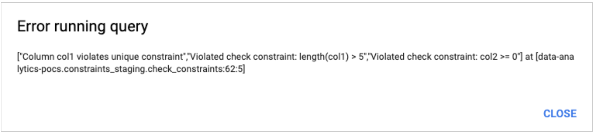
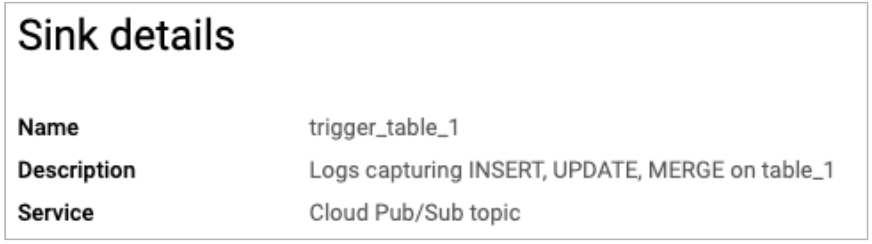
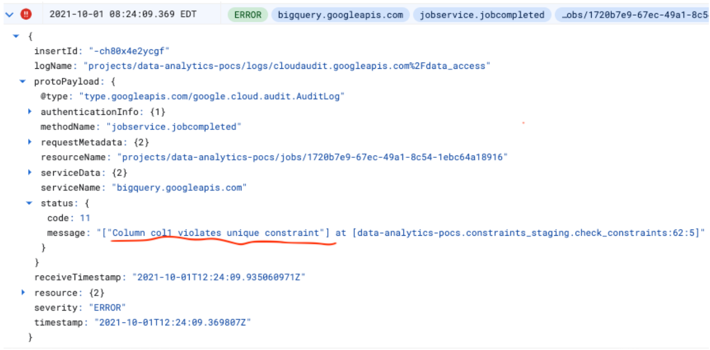

# Imitate and Check Constraints in BigQuery 

This directory describes an approach to imitate and check constraints in a BigQuery table.

Many databases support constraints that you can define on a table or column level. These are:
* Key or uniqueness constrains that ensure that every tuple in the relation is unique.
* Check constraints that allow you to specify a condition on each row in a table.

In contrast to many other databases, BigQuery doesn't implement those constraints. 
However, if you migrate from other data warehouses, you may want to imitate constraints in BigQuery. 
For example, to reduce changes in your ETL during migration, to support legacy applications, etc.

## Common Business Use Case
A company migrates their on-prem data warehouse to BigQuery. Their on-prem data warehouse supports
constraints, and many on-prem ETL pipelines rely on the ability of data warehouse to check and validate those
constraints. 

On-prem data warehouse has staging and reporting layers:
* The staging layer contains temporary tables that get populated by ETL. Those tables are usually
small and have table and column level constraints.
* The reporting layer contains large tables that store historical data. If the checking constraints successfully passed,
the staging tables are merged into the corresponding reporting tables. Otherwise, the merge operation fails.
Tables in the reporting layers don't have constraints since checking those on large tables are very costly.

The company would like to keep their ETL code and introduce only a small number of
changes to the existing code during migration.

## Approach
This directory describes how you can imitate table or column constraints in BigQuery.
The provided solution answers the following questions:
* How to define constraints in BigQuery in a consistent manner?
* How to check a constraint?
* How to trigger the constraint check?
* How to monitor the constraint check results?

### How to define constraints in BigQuery
You can leverage [INFORMATION_SCHEMA](https://cloud.google.com/bigquery/docs/information-schema-tables) 
to capture constraint definitions. BigQuery provides `description` on a [table](https://cloud.google.com/bigquery/docs/tables#create-table) 
and a [column](https://cloud.google.com/bigquery/docs/schemas#column_descriptions) levels.

You can organize information in `description` filed as JSON. For example


This method has several benefits:
* JSON provides a common approach across all BigQuery tables to store constraint descriptions.
* You can add other fields into JSON, e.g. “description” field above containing general column information.
* You can use JSON functions in BigQuery to parse metadata. See code examples below.

### How to check a constraint
You can use a BigQuery stored procedure to check constraints. See its implementation in `./sql` directory.
The procedure uses dynamic SQL, so you can check constraints on any table in BigQuery.

Call procedure as following:
```
call constraints_staging.check_constraints('table_1', 'constraints_staging');
```
In case of constraint violation procedure raises an error



Keeping this function in BigQuery is preferable in comparison to implementing it as an external script:
* Customer applications and ETLs will use the same BigQuery code to check for constraints.
* BigQuery procedures are highly available because they are under the same SLA as BigQuery data.

### How to trigger the constraint check
Use can use the following end-to-end pipeline:
```
Cloud Logging -> Pub/Sub -> Cloud Functions -> BigQuery check_constraints -> Cloud Logging
```

Here is the step-by-step description:
1. Create Cloud Logging sync:
```
resource.type="bigquery_resource" AND
proto_payload.service_data.job_insert_request.resource.job_configuration.dryRun!=true AND
proto_payload.service_data.job_completed_event.job.job_status.state="DONE" AND
severity=INFO AND
proto_payload.service_data.job_completed_event.job.job_configuration.query.statement_type=("INSERT" OR "UPDATE" OR "MERGE") AND
proto_payload.service_data.job_completed_event.job.job_configuration.query.destination_table.project_id="data-analytics-pocs" AND
proto_payload.service_data.job_completed_event.job.job_configuration.query.destination_table.dataset_id="constraints_staging" AND
proto_payload.service_data.job_completed_event.job.job_configuration.query.destination_table.table_id="table_1"
```
You can remove the last condition to catch modifications of all tables in a given dataset.

2. Create Pub/Sub subscription:



3. Create Cloud Function from ./cloud_function which is triggered when a new Pub/Sub message is published to the topic


4. The cloud function calls `check_constraints` stored procedure but it doesn’t wait till its completion 
because validating large tables may take longer than the maximum Cloud Function timeout (9 minutes).

5. After `check_constraints` stored procedure finished, its results are stored in Cloud Logging 
as any other BigQuery job. You can create a sync to Pub/Sub or BigQuery table and make customer applications 
check for `check_constraints` results


