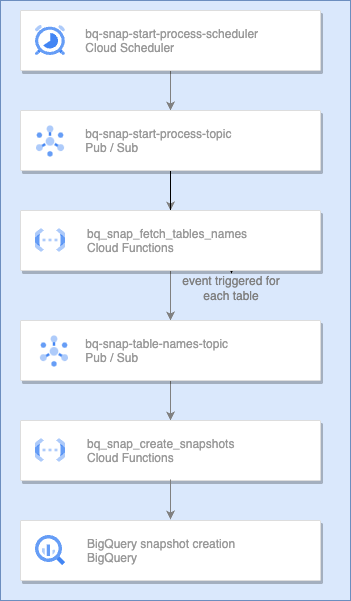

# Requirements
This solutions automates and schedules the creation of [BigQuery Table Snapshots](https://cloud.google.com/bigquery/docs/table-snapshots-intro) at dataset and project level.

# Architecture

- **bq-snap-start-process-scheduler**: responsible of triggering the process based on the provided schedule
- **bq-snap-start-process-topic**: will trigger the bq_snap_fetch_tables_names cloud function
- **bq_snap_fetch_tables_names**: this cloud function will fetch all the table names for which snapshots must be created. It contains fields that allow the user to specify what datasets and tables to include/exclude. This function will send one message to the bq-snap-table-names-topic for each table
- **bq-snap-table-names-topic**: responsible for triggering bq_snaps_create_snapshots cloud function
- **bq_snap_create_snapshots**: this cloud function will create the snapshot based on the triggering message

# Considerations
- **Target dataset name**: the target dataset name will be constructed by prefixing `SNAPSHOT_` to the source dataset name. For example all tables comming from `DATASET_1` will have thier snapshots written to `SNAPSHOT_DATASET_1`. **NOTE** `SNAPSHOT_DATASET_1` **must** exist before execution, the cloud function **will not** create it
- **Snapshot name**: snapshot name will be the same of the source table with the current date as prefix. For example `my-project.DATASET_1.table_1` might have its snapshot written to `my-project.SNAPSHOT_DATASET_1.table_1_20220101`
- **Snapshot duration**: snapshots can optionally be set to expire after a given date. This solution by default sets the `SECONDS_BEFORE_EXPIRATION` in `bq_snap_fetch_tables_names` to 30 days
- **Snapshot timestamp**: to make sure all snapshots in a given execution represent the same point in time, snapshots are created for each table as it was at the moment when `bq_snap_fetch_tables_names` was invoked
