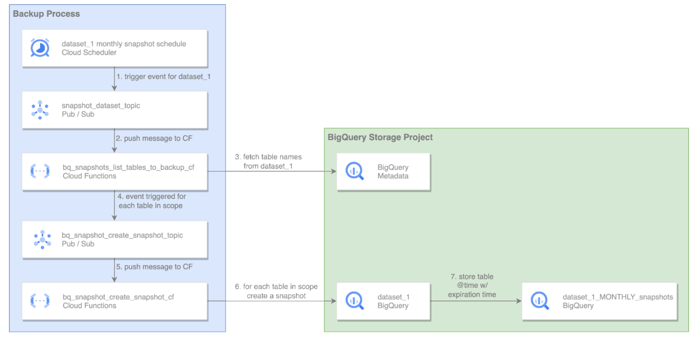

# Automate BigQuery Snapshots at Dataset Level

This solution schedules and automates [BigQuery Snapshot](https://cloud.google.com/bigquery/docs/table-snapshots-intro) creation at dataset level, helping create a single point in time picture of our data at scale.  

This solution allows for:

* Any number of datasets - This is especially useful for large organizations undergoing data growth since new datasets can be added just by adding a new Cloud Scheduler job.
* Any frequency - Users can specify desired snapshot frequency (e.g. daily, weekly, monthly, …) by changing the crontab_format schedule. 
* Customization for tables of choice - Specific tables can be easily included and excluded and snapshot duration easily specified by changing the triggering message body with minimal effort.


## Solution architecture


## bq-snap-start-process
The **bq-snap-start-process** Cloud Scheduler Job will run monthly and trigger the snapshot creation process for dataset_1. The Pub/Sub message body will contain parameters for the snapshot creation, as shown in the example below:
 
```
{
    "source_dataset_name":"DATASET_1",
    "target_dataset_name":"DATASET_1_MONTHLY_NAME",
    "crontab_format":"10 * * * *",
    "seconds_before_expiration":2592000,
    "tables_to_include_list":[],
    "tables_to_exclude_list":[] 
}
```

## bq_backup_fetch_tables_names
The **bq_backup_fetch_tables_names** cloud function will fetch all the table names in source_dataset_name. It will then apply filters based on tables_to_include_list and tables_to_exclude_list to determine the tables in scope. Finally, it will submit one Pub/Sub message per table. 

## bq_backup_create_snapshots
The **bq_backup_create_snapshots** Cloud Function will submit a BigQuery job to create a snapshot for each table in scope. This Cloud Function will suffix the snapshot name with the snapshot datetime to guarantee a unique name. It will also calculate and set the expiration time of the snapshot based on seconds_before_expiration. Finally, it will determine the snapshot time based on crontab_format. 

### About the crontab_format field
If DATASET_1 has 500 tables, 500 Pub/Sub messages are sent, and 500 Cloud Function invocations are performed. If the Cloud Function used the current time when it creates the snapshots then these 500 snapshots will represent different points in time. To avoid this the Cloud Function will create the snapshots for the table as they were when the Cloud Scheduler job (bq-snap-start-process) was triggered. To achieve this the Cloud Function will calculate the previous interval based on **crontab_format**.


# Deployment

## Declare Variables
### Set backend TF Bucket

In [backend.tf](./terraform/backend.tf) specify a bucket for persisting the terraform state in Cloud Storage (must be created before running terraform).

### Set the following variables in the [deployment_vars.tfvars](./terraform/deployment_vars.tfvars)

`project_id` project in which solution will be executed 

`storage_project_id` project used for storage 

`source_dataset_name` dataset for which datasets will be made 

`target_dataset_name` dataset where dataset will be stored 

`crontab_format` crontab for the execution of the solution

`seconds_before_expiration` seconds before the snapshot will expire

## Terraform Provisioning
```
git clone https://github.com/GoogleCloudPlatform/bigquery-utils.git

cd ./bigquery-utils/tools/cloud_functions/bq_table_snapshots/terraform

terraform init

terraform apply --auto-approve
```

