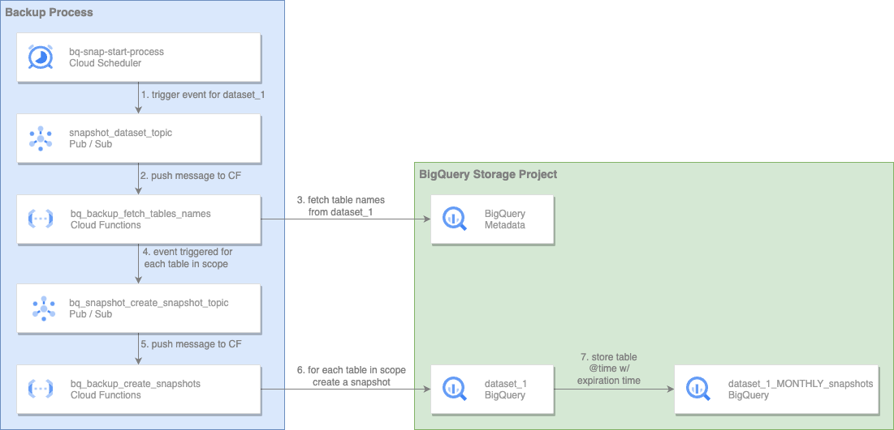

# Automate BigQuery Snapshots at Dataset Level

This solution schedules and automates [BigQuery Snapshot](https://cloud.google.com/bigquery/docs/table-snapshots-intro) creation at dataset level, helping create a single point in time picture of our data at scale.  


## Solution architecture


* dataset_1 monthly_snapshot_scheduler will run monthly and trigger the snapshot creation process for dataset_1. The Pub/Sub message body will contain parameters for the snapshot creation, as shown in the example below:
 
```
{
    "source_dataset_name":"Dataset_1",
    "target_dataset_name":"DATASET_1_MONTHLY_NAME",
    "crontab_format":"10 * * * *",
    "seconds_before_expiration":2592000,
    "tables_to_include_list":[],
    "tables_to_exclude_list":[] 
}
```

 
* the **bq_snapshots_list_tables_to_backup_cf** cloud function will fetch all the table names in source_dataset_name. It will then apply filters based on tables_to_include_list and tables_to_exclude_list to determine the tables in scope. Finally, it will submit one Pub/Sub message per table.

* the **bq_snapshot_create_snapshot_cf** cloud function will submit a BigQuery job to create a snapshot for each table in scope. This cloud function will suffix the snapshot name with the snapshot datetime to guarantee a unique name. It will also calculate and set the expiration time of the snapshot based on seconds_before_expiration. Finally, it will determine the snapshot time based on crontab_format. 

## The crontab_format field
If dataset_1 has 500 tables, 500 Pub/Sub messages are sent, and 500 Cloud Function invocations are performed. If the Cloud Function used the current time when it creates the snapshots then these 500 snapshots will represent different points in time. To avoid this the Cloud Function will create the snapshots for the table as they were when the Cloud Scheduler job (dataset_1 monthly_snapshot_scheduler) was triggered. To achieve this the Cloud Function will calculate the previous interval based on **crontab_format**.
