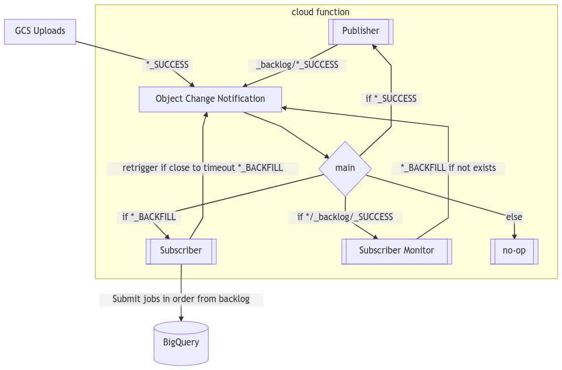

# Ordering Batches

There are use cases where it is important for incremental batches get applied in
order rather than as soon as they are uploaded to GCS (which is the default
behavior of this solution).

1. When using External Query that performs DML other than insert only.
   (e.g. an `UPDATE` assumes that prior batches have already been committed)
1. To ensure that there are not time gaps in the data (e.g. ensure that
   2020/01/02 data is not committed to BigQuery before 2020/01/01, or similarly
   that 00 hour is ingested before the 01 hour, etc.)

This Cloud Function supports serializing the submission of ingestion jobs to
BigQuery by using Google Cloud Storage's consistency guarantees to provide a
pessimistic lock on a table to prevent concurrent jobs and
[GCS Object.list](https://cloud.google.com/storage/docs/json_api/v1/objects/list)
lexicographic sorting of results to providing ordering gurantees. The solution
involves a table level `_backlog/` directory to keep track of success files
whose batches have not yet been committed to BigQuery and a table
level `_bqlock` file to keep track of what job is currently ingesting to that
table. This way we can make our Cloud Function idempotent by having all the
state stored in GCS so we can safely retrigger it to skirt the Cloud Functions
timeout.

## Assumptions

This ordering solution assumes that you want to apply batches in lexicographic
order. This is usually the case because path names usually contain some sort of
date / hour information.

## Enabling Ordering

### Environment Variables

* `ORDER_PER_TABLE` (Default: `"False"`) - Ordering can be enabled at the
  function level by setting the `ORDER_PER_TABLE`
  environment variable to `"True"`.
* `WAIT_FOR_VALIDATION` (Default: `"False"`) - Setting the `WAIT_FOR_VALIDATION`
  environment variable to `"True"` will instruct the cloud function to wait for
  a new _BACKFILL file in between every item it processes in a table's backlog.
  This is useful if you want to run your own validation process in between each
  ordered batch, and only continue to the next batch once you've completed
  validation. You instruct the cloud function to continue to the next ordered
  batch in the table's backlog by dropping a new _BACKFILL file in the top-level
  table directory.

### Config File

Ordering can be configured at any level of your naming convention (e.g. dataset
table or some sub-path) by placing a `_config/ORDERME` file. This can be helpful
in scenarios where your historical load can be processed safely in parallel but
incrementals must be ordered. For example:

```text
gs://${BUCKET}/${DATASET}/${TABLE}/historical/_config/load.json
gs://${BUCKET}/${DATASET}/${TABLE}/incremental/_config/external.json
gs://${BUCKET}/${DATASET}/${TABLE}/incremental/_config/bq_transform.sql
gs://${BUCKET}/${DATASET}/${TABLE}/incremental/_config/ORDERME
```

## Dealing With Out-of-Order Publishing to GCS During Historical Load

In some use cases, there is a period where incrementals that must be applied in
order are uploaded in parallel (meaning their `_SUCCESS` files are expected to
be out of order). This typically happens during some historical backfill period.
This can be solved by setting the `START_BACKFILL_FILENAME` environment variable
to a file name that indicates that the parallel upload of historical
incrementals is complete (e.g. `_HISTORYDONE`). This will cause all success
files for a table to be added to the backlog until the `_HISTORYDONE` file is
dropped at the table level. At that point the backlog subscriber will begin
processing the batches in order.

## Batch Failure Behavior

When ordering is enabled, if the BQ job to apply a batch failed, it is not safe
to continue to ingest the next batch. The Cloud Function will leave the
`_bqlock` file and stop trying to process the backlog. The Cloud function will
report an exception like this which should be alerted on as the ingestion
process for the table will be deadlocked until there is human intervention to
address the failed batch:

```text
    f"previous BigQuery job: {job_id} failed or could not "
    "be found. This will kill the backfill subscriber for "
    f"the table prefix {table_prefix}."
    "Once the issue is dealt with by a human, the lock"
    "file at: "
    f"gs://{lock_blob.bucket.name}/{lock_blob.name} "
    "should be manually removed and a new empty _BACKFILL"
    "file uploaded to:"
    f"gs://{lock_blob.bucket.name}/{table_prefix}/_BACKFILL"
    f"to resume the backfill subscriber so it can "
    "continue with the next item in the backlog.\n"
    "Original Exception:\n"
    f"{traceback.format_exc()}")
```

Note that once the `_bqlock` is removed and `_BACKFILL` is reposted, the Cloud
Function will proceed by applying the next batch in the `_backlog`. This means,
if you have applied the batch manually you should remove this object from the
`_backlog`. However, if you have patched the data on GCS for the failed batch
and would like the cloud function to apply it, then you leave this object in the
`_backlog`.

## Ordering Mechanics Explained

We've treated ordering incremental commits to table as a variation on the
[Producer-Consumer Problem](https://en.wikipedia.org/wiki/Producer%E2%80%93consumer_problem)
Where we have multiple producers (each call of Backlog Publisher) and a single
Consumer (the Backlog Subscriber which is enforced to be a singleton per table
with a claim file). Our solution is to use GCS `_backlog` directory as our queue
and `_bqlock` as a mutex. There is still a rare corner case of a race condition
that we handle as well.

### Backlog Publisher

The Backlog Publisher has two responsibilities:

1. add incoming success files to a table's `_backlog` so they are not "
   forgotten" by the ingestion system.
1. if there is a non-empty backlog start the backfill subscriber (if one is not
   already running). This is accomplished by uploading a table level `_BACKFILL`
   file if it does not already exist.

### Backlog Subscriber

The Backlog Subscriber is responsible for keeping track of BigQuery jobs running
on a table and ensure that batches are committed in order. When the backlog is
not empty for a table the backlog subscriber should be running for that table
unless a job has failed. It will either be polling a `RUNNING` BigQuery job for
completion, or submitting the next batch in the `_backlog`.

The state of what BigQuery job is currently running on a table is kept in a
`_bqlock` file at the table prefix.

In order to escape the maximum nine-minute (540s) Cloud Function Timeout, the
backfill subscriber will re-trigger itself by posting a new `_BACKFILL` file
until the `_backlog` for the table prefix is empty. When a new success file
arrives it is the responsibility of the publisher to restart the subscriber if
one is not already running.

### Example: Life of a Table

The following process explains the triggers (GCS files) and actions of the Cloud
Function for a single table prefix.

1. Source data uploaded to GCS prefix for the destination dataset / table, etc.
    - `gs://ingestion-bucket/dataset/table/historical/2020/01/02/03/foo-data-00.csv`
    - `gs://ingestion-bucket/dataset/table/historical/2020/01/02/03/foo-data-01.csv`
    - `gs://ingestion-bucket/dataset/table/historical/2020/01/02/04/foo-data-00.csv`
    - `gs://ingestion-bucket/dataset/table/incremental/2020/01/02/05/foo-data-01.csv`
1. Success file uploaded to GCS (to indicate this atomic batch is ready to be
   applied).
    - `gs://ingestion-bucket/dataset/table/historical/2020/01/02/03/_SUCCESS`
    - `gs://ingestion-bucket/dataset/table/historical/2020/01/02/04/_SUCCESS`
    - `gs://ingestion-bucket/dataset/table/incremental/2020/01/02/05/_SUCCESS`
1. Backlog Publisher adds a pointer to each success file in the backlog for the
   table.
    - `gs://ingestion-bucket/dataset/table/_backlog/historical/2020/01/02/03/_SUCCESS`
    - `gs://ingestion-bucket/dataset/table/_backlog/historical/2020/01/02/04/_SUCCESS`
    - `gs://ingestion-bucket/dataset/table/_backlog/incremental/2020/01/02/05/_SUCCESS`
1. If the `START_BACKFILL_FILENAME` is set and the file exists at the table
   prefix, After adding each item the backlog, the Backlog Publisher will start
   the Backfill Subscriber if it is not already running (as indicated by
   a `_BACKFILL`
   file). If the `START_BACKFILL_FILENAME` is not present the backlog subscriber
   will not be started until this file is uploaded.
    - `gs://ingestion-bucket/dataset/table/_BACKFILL`
1. The Backlog Subscriber will look at the backlog and apply the batches in
   order (lexicographic). This process looks like this:
    1. Claim this backfill file:
        - `gs://ingestion-bucket/dataset/table/_claimed__BACKFILL_created_at_...`
    1. Claim first batch in backlog (ensure no duplicate processing):
        - `gs://ingestion-bucket/dataset/table/historical/2020/01/02/03/_claimed__SUCCESS_created_at_...`
    1. Submit the BigQuery Job for this batch (load job or external query based
       on the `_config/*` files)
        - Ingest the data at
          the `gs://ingestion-bucket/dataset/table/historical/2020/01/02/03/*`
          prefix
        - Store the job ID in `gs://ingestion-bucket/dataset/table/_bqlock`
    1. Wait for this Job to complete successfully and remove this item from the
       backlog.
        - If job is `DONE` with errors:
            - Raise exception (do not continue to process any more batches)
        - If job is `DONE` without errors remove the pointer from the backlog:
          -
          DELETE `gs://ingestion-bucket/dataset/table/_backlog/historical/2020/01/02/03/_SUCCESS`
    1. Repeat from Backlog Subscriber step 2
        - Where the first item in the backlog is now
            - `gs://ingestion-bucket/dataset/table/_backlog/historical/2020/01/02/04/_SUCCESS`
        - And on the next loop:
            - `gs://ingestion-bucket/dataset/table/_backlog/incremental/2020/01/02/05/_SUCCESS`
1. Backlog Subscriber sees the `_backlog/` is empty for the table. In other
   words The BigQuery table is caught up with the data on GCS.
    - DELETE `gs://ingestion-bucket/dataset/table/_BACKFILL` and exit
1. The next day a new incremental arrives
    - `gs://ingestion-bucket/dataset/table/_backlog/incremental/2020/01/02/05/_SUCCESS`
1. The Backlog Publisher adds this item to the backlog and wakes up the Backfill
   Subscriber by posting a new `_BACKFILL` file.
    - `gs://ingestion-bucket/dataset/table/_backlog/incremental/2020/01/02/05/_SUCCESS`
    - `gs://ingestion-bucket/dataset/table/_BACKFILL`
1. Backlog Subscriber will handle the backlog of just one item
   (See Backlog Subscriber step #5 and #6 above)

### Note on Handling Race Condition

We use `subscribe_monitor` to handle a rare race condition where:

1. subscriber reads an empty backlog (before it can delete the
   _BACKFILL blob...)
2. a new item is added to the backlog (causing a separate function invocation)
3. In this new invocation we reach this point in the code path and
   start_subscriber_if_not_running sees the old _BACKFILL and does not create a
   new one.
4. The subscriber deletes the _BACKFILL blob and exits without processing the
   new item on the backlog from #2.

We handle this by the following:

1. When success file added to the backlog starts this monitoring to wait 10
   seconds before checking that the backfill file exists. To catch if the
   backfill file disappears when it should not. This might trigger an extra loop
   of the backfill subscriber but this loop will not take any action and this
   wasted compute is far better than dropping a batch of data.
1. On the subscriber side we check if there was more time than 10 seconds
   between list backlog items and delete backfill calls. If so the subscriber
   double checks that the backlog is still empty. This way we always handle this
   race condition either in this monitor or in the subscriber itself.

### Visualization of Ordering Triggers in the Cloud Function


