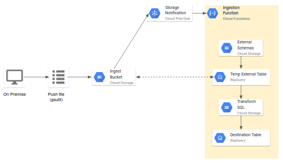

# BigQuery Serverless Ingest

Flexible service for performing  BigQuery file loads to existing tables.
This service handles splitting load jobs when the data volume exceeds
the BigQuery 15TB load job limit. The goal of the service is to orchestrate
BigQuery Load Jobs to many bigquery datasets / tables from a single bucket
providing transparent configuration that is overridable at any level.



## GCS Object Naming Convention
### Data Files
Data should be ingested to a prefix containing destination dataset and table
like so:
`gs://${INGESTION_BUCKET}/${BQ_DATASET}/${BQ_TABLE_NAME}/*`
Note, the table prefix can contain multiple sub-prefixes for handling partitions
or for configuring historical / incremental loads differently.

### Configuration Files
The Ingestion has many optional configuration files that should live in
a special `_config/` prefix at the root of the bucket and/or under the dataset
and/or table and/or under the partition prefixes.

For example if you have the following files:
```text
gs://${INGESTION_BUCKET}/_config/load.json`
gs://${INGESTION_BUCKET}/${BQ_DATASET}/_config/load.json`
gs://${INGESTION_BUCKET}/${BQ_DATASET}/${BQ_TABLE_NAME}/_config/load.json
```
The json objects will be merged where key conflicts are resolved by config in
the closest directory to the data.
If the files contents were like this:
`gs://${INGESTION_BUCKET}/_config/load.json`:
```json
{
    "sourceFormat": "CSV",
    "writeDisposition": "WRITE_APPEND",
    "schemaUpdateOptions": ["ALLOW_FILED_RELAXATION"]
}
```
`gs://${INGESTION_BUCKET}/${BQ_DATASET}/_config/load.json`:
```json
{
    "sourceFormat": "AVRO"
}
```
`gs://${INGESTION_BUCKET}/${BQ_DATASET}/_config/load.json`:
```json
{
    "writeDisposition": "WRTITE_TRUNCATE"
}
```

The result of merging these would be:
```json
{
    "sourceFormat": "AVRO",
    "writeDisposition": "WRITE_TRUNCATE",
    "schemaUpdateOptions": ["ALLOW_FILED_RELAXATION"]
}
```
This configuration system gives us the ability to DRY up common defaults but
override them at whatever level is appropriate as new cases come up.

#### Transformation SQL
In some cases we may need to perform transformations on the files in GCS
before they can be loaded to BigQuery. This is handled by query on an
temporary external table over the GCS objects as a proxy for load job.
`gs://${INGESTION_BUCKET}/${BQ_DATASET}/${BQ_TABLE_NAME}/_config/bq_transform.sql`

Note, external queries will consume query slots from this project's reservation
or count towards your on-demand billing. They will _not_ use free tie load slots.

Note, that the query should select from a `temp_ext` which will be a temporary
external table configured on the fly by the Cloud Function.
The query must handle the logic for inserting into the destination table.
This means it should use BigQuery DML to either `INSERT` or `MERGE` into the
destination table.
For example:
```sql
INSERT {dest_dataset}.{dest_table}
SELECT * FROM temp_ext
```
Note that `{dest_dataset}` and `{dest_table}` can be used to inject the dataset
and table inferred from the GCS path.


The query will be run with the appropriate [external table definitions](https://cloud.google.com/bigquery/docs/reference/rest/v2/tables#ExternalDataConfiguration)
defined in:
`gs://${INGESTION_BUCKET}/${BQ_DATASET}/${BQ_TABLE_NAME}/_config/external.json`
If this file is missing the external table will be assumed to be `PARQUET` format.

### Partitions

#### Partition Table Decorators
Note that if the directory immediately before the triggering successfile starts with
a `$` it will be treated as a BigQuery Partition decorator for the destination table.

This means for:
```text
gs://${BUCKET}/foo/bar/$20201026/_SUCCESS
```
will trigger a load job with a destination table of `foo.bar$20201026`
This allows you to specify write disposition at the partition level.
This can be helpful in reprocessing scenarios where you'd want to `WRITE_TRUNCATE`
a partition that had some data quality issue.

#### Hive Partitioning
If your data will be uploaded to GCS from a hadoop system that uses the 
[supported default hive partitioning](https://cloud.google.com/bigquery/docs/hive-partitioned-loads-gcs#supported_data_layouts)
you can specify this in the [`hivePartitioningOptions`](https://cloud.google.com/bigquery/docs/reference/rest/v2/tables#hivepartitioningoptions)
key of `load.json` for that table.

Any non-trivial incremental loading to partitions should usually use the
Transformation SQL to define the `INSERT / MERGE / UPDATE / DELETE` logic into
the target BQ table as these DML semantics are much more flexible thant the load
job write dispositions.
Furthermore, using external query has the added benefit of circumventing the 
per load job bytes limits (default 15 TB) and commiting large partitions
atomically.

## Handling Incremental Loads
This solution introduces the concept of `batch_id` which uniquely identifies 
a batch of data committed by an upstream system that needs to be picked up as an
incremental load. You can again set the load job or external query configuration
at any parent folders `_config` prefix. This allows you dictate
"for this table any new batch should `WRITE_TRUNCATE` it's parent partition/table"
or "for that table any new batch should `WRITE_APPEND` to it's parent partition/table".

## Monitoring
Monitoring what data has been loaded by this solution should be done with the
BigQuery [`INFORMATION_SCHEMA` jobs metadata](https://cloud.google.com/bigquery/docs/information-schema-jobs)
If more granular data is needed about a particular job id 

### Job Naming Convention
All load or external query jobs will have a job id witha  prefix following this convention:
```python3
job_id_prefix=f"gcf-ingest-{dest_table_ref.dataset_id}-{dest_table_ref.table_id}-{1}-of-{1}-"
```

### Job Labels
All load or external query jobs are labelled with functional component and cloud function name.
```python3
DEFAULT_JOB_LABELS = {
    "component": "event-based-gcs-ingest",
    "cloud-function-name": getenv("FUNCTION_NAME"),
    "gcs-prefix": gs://bucket/prefix/for/this/ingest,
}
```
If the destination regex matches a batch group, there will be a `batch-id` label.

### Example INFROMATION SCHEMA Query
```sql
SELECT
   job_id,
   job_type,
   start_time,
   end_time,
   query,
   total_bytes_processed,
   total_slot_ms,
   destination_table
   state,
   (SELECT value FROM UNNEST(labels) WHERE key = "component") as component,
   (SELECT value FROM UNNEST(labels) WHERE key = "cloud-function-name") as cloud_function_name,
   (SELECT value FROM UNNEST(labels) WHERE key = "batch-id") as batch_id,
FROM
   `region-us`.INFORMATION_SCHEMA.JOBS_BY_PROJECT
WHERE
   (SELECT value FROM UNNEST(labels) WHERE key = "component") = "gcf-ingest-"
```

## Triggers

### Pub/Sub Storage Notifications `_SUCCESS`
1. Trigger on `_SUCCESS` File to load all other files in that directory.
1. Trigger on non-`_SUCCESS` File will no-op

## Continuous Integration
We run the following CI checks to ensure code quality and avoid common pitfalls:
- [yapf](https://github.com/google/yapf)
- [flake8](https://flake8.pycqa.org/en/latest/)
- [isort](https://pypi.org/project/isort/)
- [mypy](https://mypy.readthedocs.io/en/stable/)
- [pylint](https://www.pylint.org/) (only on main sources not tests)
- [hadolint](https://github.com/hadolint/hadolint) for Dockerfile.ci

This CI process is defined in [cloudbuild.yaml](cloudbuild.yaml) and can be run
locally with [cloud-build-local](https://cloud.google.com/cloud-build/docs/build-debug-locally)
from this directory with:
```bash
cloud-build-local --config cloudbuild.yaml --dryrun=false .
```

### Optimizations / Philosophy
This CI system uses [kaniko cache to speed up builds](https://cloud.google.com/cloud-build/docs/kaniko-cache)
and defaults cache expiration to two weeks.
This notably does not pin python package versions so we know if one of our
dependencies or CI checks has been updated in a way that breaks this tool.
It's better for us to make a conscious decision to adopt new features or adjust
CI configs or pin older version depending on the type for failure.
This CI should be run on all new PRs and nightly.

### Just Running the Tests
#### Running in Docker
```bash
# Build Docker image
PROJECT_ID=$(gcloud config get-value project)
docker build -t gcr.io/$PROJECT_ID/gcs_event_based_ingest_ci -f Dockerfile.ci .
# Run unit tests
docker run --rm -it gcr.io/$PROJECT_ID/gcs_event_based_ingest_ci -k "not IT"
# Run integration tests
docker run --rm -it gcr.io/$PROJECT_ID/gcs_event_based_ingest_ci -k "IT"
# Run all tests
docker run --rm -it gcr.io/$PROJECT_ID/gcs_event_based_ingest_ci
```

#### Running on your local machine
Alternatively to the local cloudbuild or using the docker container to run your
tests, you can `pip3 install -r requirements-dev.txt` and select certain tests
to run with [`pytest`](https://docs.pytest.org/en/stable/usage.html). This is
mostly useful if you'd like to integrate with your IDE debugger.

Note that integration tests will spin up / tear down cloud resources that can
incur a small cost. These resources will be spun up based on your Google Cloud SDK
[Application Default Credentials](https://cloud.google.com/sdk/gcloud/reference/auth/application-default)

#### Running All Tests
```bash
pytest
```
#### Running Unit Tests Only
```bash
pytest -m "not IT"
```

#### Running Integration Tests Only
```bash
pytest -m IT
```

## Deployment
It is suggested to deploy this Cloud Function with the [accompanying terraform module](terraform_module/gcs_ocn_bq_ingest_function/README.md)

## Alternatives
### BQ Tail
[bqtail](https://github.com/viant/bqtail) is a similar serverless configuration
driven ingest to BigQuery from GCS that achieves batching based on window
in processing time (as driven by Cloud Scheduler). BQ Tail has nice features for
triggering Post actions (BQ queries / GCS file moves or deletes) once the data
is ingested, and slack notifications. bqtail is well suited for use cases where
the atomicity of event partition is not important (e.g. many distributed 
publishers uploading logs to GCS). Due to dependency of certain features of 
bqtail on Cloud Scheduler it cannot be used inside VPC-SC perimeters.
This tool might be more appropriate when the publisher is authoritative on the
atomicity of batches (e.g. an upstream  hadoop job responsible for commiting an
event time hour's worth of data). 

### BigQuery Data Transfer Service
[Cloud Storage Transfer](https://cloud.google.com/bigquery-transfer/docs/cloud-storage-transfer)
can also be used but requires separate configurations per table and supports
only scheduled (rather than event based) loads. This can cause issues if the
upstream publisher of data is behind schedule. This service does not support
external query to perform transformations upon ingest.
